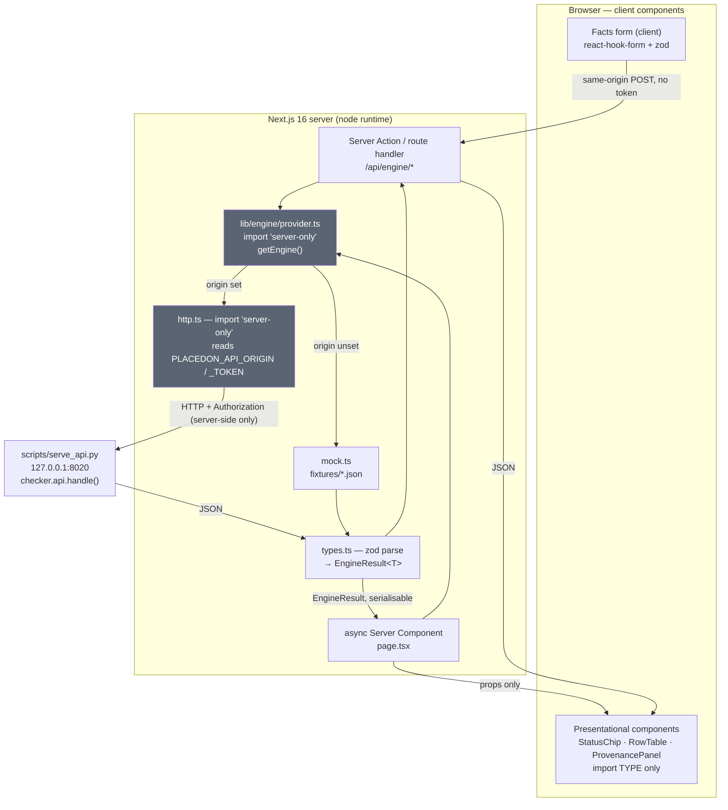

# Placedon :3300 — Backend Contract & Frontend Architecture Dossier

**Analyst:** read-only investigation. No project file was modified.
**Date of analysis:** 2026-09-11.
**Frontend under analysis:** `/Users/saiyamupadhyay/Desktop/PLACEDON/Claude Legal prototype (recovered)`
(Next.js **16.3.4**, React 19.2.8, Tailwind v4, zod 4, TypeScript strict, `next dev -p 3300`).
**Backend verified against:** `github.com/bubblebee1408/placedon-law-backend` @ commit
`f2ebcb351c2761c6ec2a1807ef172cfba5a8ecac` ("feat: Layer 1's contract, and the misbehaving model
written to attack it", Thu Sep 10 2026), cloned read-only into
`…/scratchpad/backend`. Primary evidence: `checker/api.py` (662 lines),
`scripts/serve_api.py` (148 lines), `checker/obligations.py`, `checker/event_log.py`,
`checker/currency.py`, `checker/diligence_pack.py`, `checker/release_record.py`.

> **Verification legend used throughout**
> `[VERIFIED]` — read directly in backend source at the pinned commit.
> `[DOC-ONLY]` — stated in `docs/RAG-INTEGRATION.md`, not independently re-confirmed here.
> `[CONTRADICTED]` — a repo doc says X, the code says not-X. Code wins.
> `[UNVERIFIED]` — could not be confirmed from any source; do not build on it.

---

## 0. Executive posture

`docs/RAG-INTEGRATION.md` describes itself as verified against the backend. **It is substantially
correct** — the six-route surface, the request fields, the enums and the response key sets all
check out against `checker/api.py`. I found **four small factual drifts** (§1.8) and one
**large, load-bearing contradiction that is not in RAG-INTEGRATION.md at all** but in the shipped
frontend code: `src/lib/api.ts` implements a **completely different, fictional contract** from the
one the backend serves (§3). That file cannot talk to the real backend and must be rewritten, not
extended.

---

## 1. THE VERIFIED BACKEND CONTRACT

### 1.1 Transport [VERIFIED — `scripts/serve_api.py`]

| Property | Value | Consequence for the frontend |
|---|---|---|
| Bind address | `127.0.0.1` (`HOST` constant), port `8020` (`DEFAULT_PORT`), `--port N` to override | **Loopback only.** Not reachable from a browser on another host. |
| Scheme | **plain HTTP** — `ThreadingHTTPServer`, no TLS anywhere in the file | `src/lib/api.ts` *rejects* non-`https:` origins → today it literally cannot connect. See §3.2. |
| Auth | **none.** No `Authorization` parsing, no API key, no session. Docstring: *"this serves an unauthenticated compliance API … Making this a hosted, authed, rate-limited service is a deliberate deployment step"* | A bearer token is a **future** concern — but design the boundary for it now (§5). |
| CORS | **no `Access-Control-Allow-*` header is ever sent**; there is no `do_OPTIONS` | **A browser `fetch()` to this server will fail CORS.** This alone forces a server-side proxy. |
| Response headers | `Content-Type: application/json; charset=utf-8`, `Cache-Control: no-store`, `X-Content-Type-Options: nosniff`, `Content-Security-Policy: default-src 'none'` | Mirror `no-store` in the Next.js route handler; never cache a pack. |
| Body cap | `MAX_BODY = 256 * 1024` (256 KB) on POST | Payloads are tiny; irrelevant in practice. |
| Facts in body, never URL | Explicit design rule; `log_message` logs `method + path.split('?')[0]` only | **Never put company facts in a query string** — the access log is the threat model. |
| Invalid JSON body | `400 {"error":"bad_request","detail":"invalid JSON body: …"}` | Same error shape as validation failures. |
| Core | `handle(method, path, body, *, generated_at) -> (status, dict)` — a **pure function**, no I/O | Fixtures for MockProvider can be generated by calling `handle()` directly. |

`generated_at` is produced by the server as `datetime.now(timezone.utc).strftime("%Y-%m-%dT%H:%M:%SZ")`
— i.e. `"2026-09-11T04:12:33Z"`, second precision, **not** full ISO-8601 with fractional seconds.

### 1.2 The route table — exactly six, no more [VERIFIED — `checker/api.py::handle`]

```
GET  /v1/health
POST /v1/compliance-pack
POST /v1/document-check
GET  /v1/company/{cin}/events
GET  /v1/company/{cin}/events/{event_id}
GET  /v1/instruments/{fragment}/affected
```

This list is not inferred — it is the literal `routes` array the 404 branch returns
(`checker/api.py:428-432`), and each is matched by an explicit branch in `handle()`.

**Routes that DO NOT EXIST [VERIFIED by exhaustive grep across `**/*.py`]:**

- **`GET /v1/company/{cin}/standing` — DOES NOT EXIST.** The string `standing` appears 18 times in
  the repo, every one of them inside English prose in a docstring, test fixture, or provision text
  (e.g. "the continuing directors", "free-standing floor", "The company is in good standing." as a
  `MODEL_SUGGESTION` test value). **Zero route definitions.** `AGENTS.md` names this route; it is wrong.
- **`POST /v1/ask` — DOES NOT EXIST.** No F9 answer endpoint. No model is wired.

Path matching detail worth knowing: `handle()` does `path.rstrip("/")`, so `/v1/health/` works, and
it splits on `?` itself, so the query string is parsed by `checker/api._query` via `parse_qsl`
(`keep_blank_values=False` — an empty `?as_of=` is *dropped*, not an error).

### 1.3 `GET /v1/health` [VERIFIED — api.py:406-415]

Request: no params, no body.

**200 (provenance succeeds):**
```json
{ "status": "ok", "no_model": true,
  "benchmark_version": "v3", "corpus_version": "sha256:…", "checker_commit": "…" }
```
**200 (provenance fails):** the three version fields are **replaced** (not supplemented) by a single key:
```json
{ "status": "ok", "no_model": true, "provenance_error": "…" }
```
Note `benchmark_version` is hardcoded `"v3"` at the call site; `corpus_version` starts with `sha256:`
(`release_record._test` asserts this). `working_tree_dirty` is **NOT** in the health payload — it
appears only inside the compliance-pack `provenance` block.

> Frontend implication: health is a **discriminated union on the presence of `provenance_error`**, not
> on `status`. `status` is always `"ok"` when the process answers at all. "Unhealthy" is expressed by
> the connection failing, not by a status field.

### 1.4 `POST /v1/compliance-pack` [VERIFIED — api.py:84-164]

**Request body.** Validated by `_profile` + `_evidence`. Unknown top-level keys are **tolerated**
(unlike document-check, which rejects them — a real asymmetry, do not assume symmetry).

*Required:*
| Field | Type | Rule |
|---|---|---|
| `company_class` | `"private" \| "public" \| "opc"` | `_req` + membership test; anything else → 400 |
| `incorporation_date` | ISO `YYYY-MM-DD` | `date.fromisoformat`; required |
| `as_of` | ISO `YYYY-MM-DD` | required |

*Optional profile:* `cin` (string, passed straight through — **no format validation server-side**),
`financial_year` (string, e.g. `"2024-25"`), `director_count` (passed through unvalidated),
and five booleans: `is_listed`, `is_section_8`, `is_holding_company`, `is_subsidiary_company`,
`governed_by_special_act`. A non-boolean for any of those → 400 (`_bool` rejects; `None`/absent is legal
and means *unknown*, which is **not** the same as `false`).

*Money — four fields, strict:* `paid_up_capital_rupees`, `turnover_rupees`, `net_worth_rupees`,
`net_profit_rupees`. Rules from `_figure`: must be `int`, **`bool` is explicitly excluded**
(`isinstance(v, bool)` guard — because `True` is an `int` in Python), must be `>= 0`, and
**`financial_year` must be present** or → `400 "{key}_rupees was given but financial_year is missing"`.
Whole rupees, no paise, no float.

*`evidence` (object; non-object → 400 `"'evidence' must be an object"`):*
`agm_dates` (list of ISO dates), `financial_year_end` (ISO), `board_meetings` (list of ISO),
`calendar_year` (passed through), `aoc4_filed_on` (ISO), `annual_return_filed_on` (ISO),
`resident_director_days` (passed through), `first_financial_year_end` (ISO).
A list field that is not a list → 400; a non-date inside a list → 400 naming the offending item.

**Response 200 — the exact serialised key set:**
```jsonc
{
  "company_class": "private",
  "cin": "U74999DL2015PTC000001",        // or null
  "as_of": "2026-08-31",
  "financial_year": "2024-25",           // or null
  "generated_at": "2026-09-11T04:12:33Z",
  "provenance": { … },                   // see below — a UNION
  "summary": { "not_satisfied": 0, "undetermined": 0, "cannot_determine": 0,
               "satisfied": 0, "not_applicable": 0 },
  "rows": [ {
      "obligation_id": "CA13-S96-AGM",
      "duty": "…", "provision": "…",
      "state": "APPLIES_SATISFIED|APPLIES_NOT_SATISFIED|APPLIES_UNDETERMINED|DOES_NOT_APPLY|CANNOT_DETERMINE",
      "basis": "…",
      "missing_facts": ["…"],            // always an array (list(r.missing_facts))
      "blocked_by": "task-id" ,          // or null  (`r.blocked_by or None` — "" becomes null)
      "cited_spans": [ { "path": "…", "sha256": "…", "resolved": true } ]
  } ],
  "unverified": [ { "obligation_id": "…", "to_settle": "…" } ],
  "law_currency_watch": [ { "obligation_id": "…", "status": "…",
                            "instrument": "…", "detail": "…" } ],
  "what_this_is":   [ "…" ],             // tuple ESTABLISHES, serialised as array
  "what_it_is_not": [ "…" ]              // tuple DOES_NOT_ESTABLISH
}
```

**`provenance` is a discriminated union [VERIFIED — `diligence_pack.build_pack:126-138`]:**
```ts
type Provenance =
  | { benchmark_version: string; corpus_version: string; checker_commit: string;
      working_tree_dirty: boolean; law_as_of: string }
  | { error: string; note: string };   // "…treat this pack as non-reproducible"
```
Discriminate on `"error" in provenance`. The failure branch carries a fixed `note` string telling the
reader the pack is non-reproducible — **render it**; it is the honesty surface.

`law_as_of` is set from `profile.as_of`, i.e. the pack's own `as_of` echoed through the provenance
machinery. `cited_spans` come from `checker.obligation_citations.structural_cites(obligation_id)` —
they are a function of the *obligation id*, not of the company facts, so they are stable per row type.

> **[CONTRADICTED] `no_model` is NOT present on the compliance-pack response.** RAG-INTEGRATION.md §2
> says *"Every response carries `no_model`: true."* False. `compliance_pack()` (api.py:142-164) has no
> such key. `no_model: true` **is** present on `/v1/health`, `/v1/document-check`, both events routes,
> and `/v1/instruments/…/affected` — five of six. **Type `no_model` as optional on the pack**, or the
> zod parse will fail on the real backend.

### 1.5 `POST /v1/document-check` [VERIFIED — api.py:264-364]

*"A document was made on one date and is being read on another. Has the law it rests on moved in
between?"* Deterministic, fails closed.

**Request — strict allow-list.** `_DOC_CHECK_KEYS` is a `frozenset` of exactly 16 keys, and an unknown
key raises a 400 whose `detail` **names every offending key and explains the `_rupees` suffix**:
```
document_date, as_of, company_class, incorporation_date, cin, financial_year,
is_listed, is_section_8, is_holding_company, is_subsidiary_company,
governed_by_special_act, director_count,
paid_up_capital_rupees, turnover_rupees, net_worth_rupees, net_profit_rupees
```
Note: **no `evidence` object here** — passing one is a 400. `document_date` required ISO; `as_of`
defaults to `generated_at[:10]` (server's today). `document_date > as_of` → 400 with the memorable
detail *"a document cannot be read before it was made"*. Internally `_profile` is called twice — once
dated to the document, once to the read date — so `company_class` and `incorporation_date` remain
required through `_profile`.

**Response 200:**
```jsonc
{
  "document_date": "2024-06-01", "as_of": "2026-09-11",
  "generated_at": "2026-09-11T04:12:33Z",
  "summary": { "superseded": 0, "cannot_verify": 0, "verified": 0 },
  "superseded": [ { "obligation_id","duty","provision",
                    "was_at_document_date","is_at_read_date",
                    "governed_then","governs_now","instrument","detail","reference" } ],
  "cannot_verify": [ /* SEE BELOW — this is a UNION of two shapes */ ],
  "verified": [ { "obligation_id","duty","provision","state","basis" } ],
  "what_this_is": [ … ], "what_it_is_not": [ … ],
  "no_model": true
}
```

> **[CONTRADICTED / refinement] `cannot_verify[]` has TWO distinct shapes.** RAG-INTEGRATION.md §3.3
> shows one. The code (api.py:309-312 vs 339-345) emits:
> - **Branch A — "no declared currency basis"** (obligation absent from the currency map):
>   `{ obligation_id, duty, provision, detail: "no declared currency basis", reference: null }`
>   — **no `instrument`, no `already_open_at_document_date`.**
> - **Branch B — already open at the document date:**
>   `{ obligation_id, duty, provision, detail, instrument, already_open_at_document_date: true, reference }`
>
> Type it as a union with `already_open_at_document_date?: true` optional, or the parse breaks on
> Branch A. The UI copy must differ too: A = *"we hold no currency basis for this duty"*;
> B = *"this was already unsettled when the document was made — nothing moved under the author."*

**"Moved" is defined as** (api.py:322-324): `instrument_changed = (was.instrument or "") != (now.instrument or "")`
**OR** `degraded = was.status == CURRENT and now.status != CURRENT`. The comment explains *why*
instrument-change is the primary test: once G.S.R. 880(E) was attested, both dates read `CURRENT`
and a status-only comparison stopped firing on exactly the case the feature exists for.

`reference` on both `superseded` and `cannot_verify` Branch B is `rows_now[oid].blocked_by or None` —
i.e. **a task id or null**, the thing that would settle it.

### 1.6 `GET /v1/company/{cin}/events` and `…/events/{event_id}` [VERIFIED — api.py:202-230, 375-393]

**`cin` is a raw path segment, echoed back verbatim, and never validated.** The test suite itself
calls `/v1/company/X/events` and gets a 200 with `"cin": "X"`. **The events are not per-company at all
in v0** — `events_for(as_of, since=since)` takes no cin. Do not build UI implying company-specific
history.

**Query params** (all optional, all on the query string — these are law facts, not company facts):
| Param | Type | Default | Failure |
|---|---|---|---|
| `as_of` | ISO date | server today (`generated_at[:10]`) | non-ISO → 400 naming the field |
| `since` | ISO date | `null` | `since > as_of` → 400 `"'since' (X) is after 'as_of' (Y)"` |
| `kind` | `"law" \| "company"` | unset | other → 400. **`kind=company` returns `events: []`** (hard-coded `events = []`) |
| `class` | `"fact" \| "consequence" \| "signal"` | unset | other → 400 listing valid values |

`class` maps to `output_class` via `{"fact": "VERIFIED_FACT", "consequence": "DETERMINISTIC_CONSEQUENCE",
"signal": "SIGNAL"}` — **the wire filter value and the returned enum are different strings.** Do not
send `class=VERIFIED_FACT`.

**List response 200:**
```jsonc
{ "cin": "<echoed>", "as_of": "…", "since": null, "generated_at": "…",
  "scope": "law_change_only — company-fact events require the licensed registry feed and are not served in v0; an absence here is not evidence that nothing happened to this company",
  "events": [ Event… ], "no_model": true }
```
The `scope` string is a **constant** (`_V0_SCOPE`) and is the product's most important caveat.
Render it verbatim next to any empty events list.

**Event object [VERIFIED — `_event_json`, api.py:174-191]:**
```ts
{
  id: string;                 // 16-hex content hash; EXCLUDES known_at (bitemporal)
  at: string;                 // valid time  — when the change took effect
  known_at: string;           // transaction time — when we learned it
  kind: "LAW_CHANGE" | "COMPANY_FACT";
  subtype: "THRESHOLD_MOVED" | "OBLIGATION_SUPERSEDED" | "OBLIGATION_NOW_IN_FORCE"
         | "BASIS_UNACQUIRED" | "BASIS_UNDECLARED";     // [VERIFIED: the full set, event_log.py:55-59]
  title: string;
  output_class: "VERIFIED_FACT" | "DETERMINISTIC_CONSEQUENCE" | "SIGNAL";
  currency_state: string;     // one of the currency literals, §1.9
  obligation_id: string;
  consequence: string;
  verified_by: string | null;
  source: { instrument: string; as_at: string | null; sha256: string | null; url: string | null };
}
```
**Invariant enforced in the backend constructor (`event_log.py:105-107`): an event with
`verified_by === null` can never be `VERIFIED_FACT` — construction raises.** So in the UI,
`verified_by === null` ⟹ the event is a `SIGNAL` (or a `DETERMINISTIC_CONSEQUENCE`) and must never
wear the visual costume of a verified fact. `BASIS_UNDECLARED` is documented in the source as
*"a hole in OUR map, not a fact about the law"* — that distinction belongs in the UI copy.

**Single-event response 200:** `{ cin, as_of, generated_at, event: Event, no_model: true }`
— note it has **no `since` and no `scope`**, unlike the list route.
**404:** `{ "error": "not_found", "detail": "no event 'X' at as_of 2026-09-09" }` —
> **[CONTRADICTED]** this 404 has **no `routes[]` key**. Only the *global* fall-through 404
> (unknown path) carries `routes[]`. Type `routes` as optional on the 404 body.

### 1.7 `GET /v1/instruments/{fragment}/affected` [VERIFIED — api.py:395-404]

`fragment` is URL-decoded with `unquote`. `fragment.strip()` empty → `400 {"error":"bad_request",
"detail":"empty instrument fragment"}`. Real fragments look like `880(E)` — **`(` and `)` must be
percent-encoded** by the client (`encodeURIComponent` handles this only if you also encode parens;
`encodeURIComponent("880(E)")` leaves parens literal, which is legal in a path segment but encode
defensively).

**200:** `{ "instrument": "<the decoded fragment, echoed>", "generated_at": "…",
"obligations": string[], "no_model": true }`.
`obligations` is `currency.affected_by(fragment)` → **`list[str]` of obligation ids**, not objects.
No body, no query params.

### 1.8 Summary of drifts found between `docs/RAG-INTEGRATION.md` and the code

| # | RAG-INTEGRATION.md says | Code says | Severity |
|---|---|---|---|
| 1 | "Every response carries `no_model: true`" (§2) | **compliance-pack does not** (5 of 6 routes do) | **High** — breaks a strict zod parse |
| 2 | `cannot_verify[]` has one shape (§3.3) | **Two shapes**; Branch A lacks `instrument` and `already_open_at_document_date` | **High** — breaks a strict zod parse |
| 3 | 404 carries `routes[]` (§3) | Only the *global* 404 does; the event 404 does not | Medium |
| 4 | Events described as a per-company "Sentinel stream" | `cin` is echoed, never validated, never used to filter; `events_for()` ignores it | Medium — a UI honesty issue |

Everything else in RAG-INTEGRATION.md §3, §4 and §8 that I checked — the six routes, the required
fields, the `_rupees` discipline, the five row states, the three output classes, the `scope` caveat,
the absence of `/standing` and `/ask` — **is accurate.** Treat the document as trustworthy with these
four corrections applied.

### 1.9 Enum reference card [VERIFIED]

```ts
// checker/obligations.py:47-58 — compliance-pack row.state
type RowState = "APPLIES_SATISFIED" | "APPLIES_NOT_SATISFIED" | "APPLIES_UNDETERMINED"
              | "DOES_NOT_APPLY" | "CANNOT_DETERMINE";
const NEEDS_ATTENTION = ["APPLIES_NOT_SATISFIED", "APPLIES_UNDETERMINED", "CANNOT_DETERMINE"];
// DOES_NOT_APPLY (a real "no") and CANNOT_DETERMINE (an "I don't know") are NEVER collapsed.

// checker/event_log.py:49-52 — event.output_class
type OutputClass = "VERIFIED_FACT" | "DETERMINISTIC_CONSEQUENCE" | "SIGNAL";

// checker/event_log.py:44-45 / :55-59
type EventKind = "LAW_CHANGE" | "COMPANY_FACT";
type EventSubtype = "THRESHOLD_MOVED" | "OBLIGATION_SUPERSEDED" | "OBLIGATION_NOW_IN_FORCE"
                  | "BASIS_UNACQUIRED" | "BASIS_UNDECLARED";

// checker/currency.py:40-44 — currency_state, was_at_document_date, is_at_read_date,
// and law_currency_watch[].status all draw from this set
type CurrencyState = "CURRENT" | "NOT_YET_IN_FORCE" | "SUPERSEDED" | "UNACQUIRED" | "UNDECLARED";
```

`CurrencyState` was **not** enumerated in RAG-INTEGRATION.md (it shows `"status":"…"`). Having the
literal set lets you write exhaustive `switch` statements and copy for each.

### 1.10 What is NOT built [VERIFIED by absence + DOC-ONLY for the internals]

- **No `/v1/ask`, no model wired.** The F9 safety spine (`evidence_pack.py`, `model_adapter.py`,
  `claim_verifier.py`, `cascade.py`, `attribution.py`) exists in the repo but has **no HTTP surface**.
  Do not add a client method for it.
- **F9 vocabulary (for later, [DOC-ONLY]):** model-adapter `DECISIONS` = `APPLIES`, `DOES_NOT_APPLY`,
  `INSUFFICIENT_FACTS`, `INSUFFICIENT_EVIDENCE` (the abstention). `BUDGET_EXHAUSTED` exists but is not
  model-emittable. `claim_verifier.establishes_support()` is True only for `SUPPORTED`, which is
  **currently unreachable** — nothing the code produces authorises a legal statement on its own today.
- **F10 controlled drafting ([DOC-ONLY], not on the HTTP surface):** slot types `SOURCE_QUOTE`,
  `USER_FACT`, `DERIVED_FACT`, `TEMPLATE_TEXT`, `MODEL_SUGGESTION`, `UNKNOWN`; approval blocked while
  any `MODEL_SUGGESTION` or `UNKNOWN` is present. No route serves this. Not a :3300 surface yet.
- **Point-in-time reconstruction** (`checker/as_of.py`) is present but **UNVERIFIED** per the docs —
  nothing is served as point-in-time. Do not build a time-travel slider.

---

## 2. THE :3300 TYPED DATA LAYER AS IT EXISTS TODAY

### 2.1 File-by-file [VERIFIED — read in full]

| File | Lines | Role | Verdict |
|---|---|---|---|
| `src/lib/api.ts` | 152 | zod schemas + `ApiProvider` + `MockProvider` + `HttpProvider` | **Wrong contract. Rewrite (§3).** |
| `src/lib/tokens.ts` | 10 | `palette` — the single hex source of truth, mirrored by CSS custom properties | Keep. `abstain: "#5B6472"` lives here. |
| `src/lib/site.ts` | 42 | `siteOrigin()` reads `SITE_ORIGIN`; `pageMetadata(route)` | Keep. Clean env-gating pattern to copy. |
| `src/lib/legal.ts` | 50 | `legalSource/legalDetails/legalReady/legalDocument` — `node:fs` reads at request time, `{{TOKEN}}` substitution, `LEGAL_REVIEW_CONFIRMED` gate | Keep. **Server-only by construction** (imports `node:fs`) — the pattern to imitate. |
| `src/lib/intake.ts` | 100 | `requestSchema` (zod discriminated union `waitlist`/`pilot`), `secureEndpoint()`, `intakeConfiguration()`, `storeRequest()` | Keep. **This is the reference implementation of the correct boundary** (§4.3). |

**Consumers of `api.ts`: exactly one — `tests/contracts.mjs`.** No component, page, or route handler
imports it. It is **dead code today**, which is fortunate: it means fixing it breaks nothing.
The visible "answer class" UI (`src/components/evidence-card.tsx`, `AnswerExplorer`) is driven by
**static marketing copy** in `src/lib/placedon-content/content/shared.ts::answerClasses`, not by any
provider.

### 2.2 The existing provider pattern

```ts
export interface ApiProvider {
  compliancePack(query: ComplianceQuery): Promise<CompliancePack>;
  standing(cin: string): Promise<Standing>;                 // route does not exist
  events(cin: string): Promise<CompanyEvents>;
  health(): Promise<{ status: "available" | "unavailable" | "mock" }>;
}
```

*What is good and must be preserved:*

1. **One interface, two implementations.** Correct shape.
2. **`MockProvider` returns an explicit abstention for every answer** — the fail-closed golden rule
   encoded in the mock itself. The comment says it: *"No fabricated legal output: every mock answer is
   an explicit abstention."*
3. **`HttpProvider` parses through zod at the boundary** and, on failure, **degrades to the abstention**
   rather than throwing a fabricated shape at the UI.
4. **Hard transport hygiene:** `cache: "no-store"`, `redirect: "error"`, `AbortSignal.timeout(8000)`,
   explicit `Accept`, origin validated against username/password/search/hash/pathname injection.
5. **`companyId()`** validates CIN as `/^[A-Z0-9]{21}$/` before interpolating into a path — correct
   instinct even though the backend does not care.
6. **Response/request identity check:** `if (result.cin !== cin) throw` — guards against a substituted
   record. Keep this idea.

### 2.3 What is wrong [VERIFIED against §1]

| # | Problem | Evidence |
|---|---|---|
| **A** | **The entire response schema is invented.** `api.ts` models a flat `{answers: [{status, classification, statement, evidence:{source,quote,instrument,operative_date,as_of}, assumptions}]}`. The backend returns `{company_class, cin, as_of, financial_year, generated_at, provenance, summary, rows[], unverified[], law_currency_watch[], what_this_is[], what_it_is_not[]}`. **Zero field overlap** beyond `as_of`. | api.ts:3-26 vs api.py:142-164 |
| **B** | **`standing()` calls `/v1/company/{cin}/standing`, which does not exist.** It will 404 forever. It is silently swallowed into `abstention` by the `catch`, so it will *look* like a principled abstention when it is actually a routing bug. **This is the single most dangerous defect** — a wiring error disguised as the product's honesty feature. | api.ts:123-134; §1.2 |
| **C** | **The output-class vocabulary is a third, non-existent one.** `api.ts` uses `verified_fact \| deterministic_conclusion \| predictive_signal` (from `AGENTS.md`). The backend has **two** real vocabularies: row `state` (5 literals) and event `output_class` (3 literals, `SCREAMING_CASE`). `predictive_signal` has **no backend counterpart at all** — nothing in the engine predicts. | api.ts:14-18; §1.9 |
| **D** | **`ComplianceQuery` is wrong.** It sends `{question, as_of, facts}`. The backend wants `{company_class, incorporation_date, as_of, …, evidence:{…}}` and has **no `question` field** — there is no question-answering endpoint. | api.ts:42-46 vs §1.4 |
| **E** | **`HttpProvider` requires `https:`** (`if (url.protocol !== "https:") throw`). The backend is **plain HTTP on 127.0.0.1:8020**. The constructor throws before a single request. | api.ts:88-95 vs §1.1 |
| **F** | **No route for `/v1/document-check` or `/v1/instruments/{fragment}/affected`** — two of the six real routes are unrepresented. | §1.2 |
| **G** | **`events()` does not degrade** — it lets the zod `ParseError` escape while `compliancePack()` and `standing()` swallow theirs. Inconsistent failure policy across one interface. | api.ts:135-142 |
| **H** | **The 400/404 `detail` is discarded.** `if (!response.ok) throw new Error("The evidence service is unavailable")` throws away the backend's most valuable output: *the exact offending field name*. The contract mandates surfacing it. | api.ts:111 |
| **I** | **Health mis-models the backend.** It parses `{status:"ok"}` and maps everything else to `"unavailable"`. It ignores `no_model`, the three version fields, and the `provenance_error` union — i.e. it drops the whole "state of the record" surface. | api.ts:143-151 vs §1.3 |
| **J** | **`private token?: string` on a class that any component could import.** See §4 — this is the security hole. | api.ts:81 |

### 2.4 Where `AGENTS.md` disagrees with the backend

`AGENTS.md` (Engineering standards) states:

> *"Product data behind a typed API client with a `MockProvider` now and an `HttpProvider` matching the
> real backend contracts (`/v1/compliance-pack`, `/v1/company/{cin}/standing`, `/v1/company/{cin}/events`;
> output classes `verified_fact | deterministic_conclusion | predictive_signal` + `abstained`)."*

Three of those five specifics are wrong against the code:

| `AGENTS.md` | Reality | Resolution |
|---|---|---|
| `/v1/company/{cin}/standing` | **Does not exist** [VERIFIED by exhaustive grep] | Delete it. `RAG-INTEGRATION.md` §3 explicitly warns: *"There is NO `/v1/ask` and NO `/v1/company/{cin}/standing`… Do not stub them into the client as if they exist."* |
| `verified_fact / deterministic_conclusion / predictive_signal` | Backend has `VERIFIED_FACT / DETERMINISTIC_CONSEQUENCE / SIGNAL` (events) and a separate 5-literal row `state` | Treat the `AGENTS.md` trio as a **presentation vocabulary** for the marketing site, and keep it strictly separate from wire types (§4.5). Never let the snake_case trio near a zod wire schema. |
| `/v1/compliance-pack`, `/v1/company/{cin}/events` | Correct | Keep. |

Missing from `AGENTS.md` entirely: `/v1/health`, `/v1/document-check`,
`/v1/company/{cin}/events/{event_id}`, `/v1/instruments/{fragment}/affected`.

**Recommendation:** `AGENTS.md` is authoritative for brand/voice/a11y and should stay so.
`docs/RAG-INTEGRATION.md` (with the four corrections in §1.8) is authoritative for the API.
The one line in `AGENTS.md` quoted above should be amended to point at RAG-INTEGRATION.md rather than
enumerate routes — an enumerated route list in a second file is how this drift happened.

### 2.5 Candidate routes from project memory — adjudicated

| Candidate | Verdict |
|---|---|
| `GET /v1/health` | **[VERIFIED] EXISTS** |
| `POST /v1/compliance-pack` | **[VERIFIED] EXISTS** |
| `POST /v1/document-check` | **[VERIFIED] EXISTS** |
| `GET /v1/company/{cin}/events` | **[VERIFIED] EXISTS** |
| `GET /v1/company/{cin}/events/{id}` | **[VERIFIED] EXISTS** |
| `GET /v1/instruments/{fragment}/affected` | **[VERIFIED] EXISTS** |
| `GET /v1/company/{cin}/standing` | **[VERIFIED] DOES NOT EXIST** — remove from `AGENTS.md` and `api.ts` |
| `POST /v1/ask` | **[VERIFIED] DOES NOT EXIST** — F9 unbuilt |

**No route outside the six was invented or assumed in this dossier.**

---

## 3. THE SECURITY PROBLEM, STATED PRECISELY

`src/lib/api.ts` exports `class HttpProvider` whose constructor is
`constructor(origin: string, private token?: string, private fetcher = fetch)`.

In the Next.js App Router, **a module is only server-only if nothing in a `"use client"` graph imports
it.** Nothing in `api.ts` enforces that. The failure mode is one import away and is silent:

```tsx
"use client";
import { HttpProvider } from "@/lib/api";                 // no error, no warning
const p = new HttpProvider(origin, process.env.NEXT_PUBLIC_PLACEDON_API_TOKEN);
```

Six files in this repo already carry `"use client"` (`src/app/page.tsx`, `src/app/error.tsx`,
`src/components/{consent,evidence-card,navigation,request-form}.tsx`), including the **home page
itself**. A future developer wiring a live demo into `page.tsx` would reach for `HttpProvider`, and:

1. The provider class, its zod schemas, and the fetch code are **bundled into the browser**.
2. To make it work they need the token client-side, so they prefix it `NEXT_PUBLIC_` — and
   `PLACEDON_API_TOKEN` is **inlined verbatim into a public JS chunk**, permanently, in the build output.
3. Even without a token, the call fails at the browser: the backend is **loopback-only, HTTP-only, and
   sends no CORS headers** (§1.1). The failure is swallowed by `catch → abstention` (defect B), so the
   product silently shows "abstained" — the honesty state — for a **pure infrastructure fault**.

**Point 3 is the deeper harm.** For Placedon specifically, an error that masquerades as an abstention
corrupts the product's core promise. `RAG-INTEGRATION.md` §8.4 states the rule: *"A degraded/network
state must look different from an abstention: an abstention is a correct answer; an error is not."*
The current `catch { return { answers: [abstention] } }` violates it in three places.

### 3.1 The fix, in one sentence

**The `HttpProvider` must be physically unreachable from client code, and a transport failure must
produce a `transport_error` value that the UI renders differently from an abstention.**

---

## 4. RECOMMENDED FRONTEND ARCHITECTURE

### 4.1 Layer map

```
┌── BROWSER (client components) ────────────────────────────────────────────┐
│  Presentational components only. Import types from lib/engine/types.ts     │
│  (`import type` — erased at compile time). Zero provider imports.          │
│  Fetches, if any, hit SAME-ORIGIN /api/engine/*. Never 127.0.0.1:8020.     │
└───────────────────────────────┬───────────────────────────────────────────┘
                                │ same-origin, no token ever crosses this line
┌───────────────────────────────▼─── NEXT.JS SERVER (node runtime) ─────────┐
│  src/app/**/page.tsx        Server Components — call getEngine() directly  │
│  src/app/api/engine/*/route.ts  Route Handlers — only for client-initiated │
│                                 interaction (forms, polling, pagination)   │
│  src/lib/engine/provider.ts  "server-only"; getEngine() picks Mock|Http    │
│  src/lib/engine/http.ts      "server-only"; fetch → 127.0.0.1:8020         │
│  src/lib/engine/mock.ts      fixtures generated from checker/api._test()   │
│  src/lib/engine/types.ts     types + zod schemas (isomorphic, no secrets)  │
└───────────────────────────────┬───────────────────────────────────────────┘
                                │ HTTP, loopback, no TLS, Authorization if configured
┌───────────────────────────────▼─── PLACEDON ENGINE ───────────────────────┐
│  scripts/serve_api.py  →  checker.api.handle()  →  deterministic checker   │
└───────────────────────────────────────────────────────────────────────────┘
```

### 4.2 Proposed file layout

```
src/lib/engine/
  types.ts        # wire types + zod schemas. NO secrets, NO fetch. Safe anywhere.
  errors.ts       # EngineResult<T> union: ok | bad_request | not_found | transport_error
  provider.ts     # "server-only"; interface EngineProvider; getEngine() factory
  mock.ts         # MockEngine — fixtures byte-shaped like the real responses
  http.ts         # "server-only"; HttpEngine — the ONLY module that knows the origin/token
  fixtures/       # compliance-pack.json, document-check.json, events.json, …
src/app/api/engine/
  compliance-pack/route.ts
  document-check/route.ts
  company/[cin]/events/route.ts
  company/[cin]/events/[eventId]/route.ts
  instruments/[fragment]/affected/route.ts
  health/route.ts
```

### 4.3 The server boundary — three enforcement mechanisms, all three used

**(1) The `server-only` package.** Top line of `provider.ts` and `http.ts`:
```ts
import "server-only";
```
This turns an accidental client import into a **build-time error**, not a runtime leak. It is the
canonical Next.js mechanism and costs one dependency. (`client-only` is its mirror.)

**(2) Non-`NEXT_PUBLIC_` env vars, read only inside the server module.** `.env.example` already has
`PLACEDON_API_ORIGIN` and `PLACEDON_API_TOKEN` with the correct (unprefixed) names — **keep them
unprefixed forever.** Next.js only inlines `NEXT_PUBLIC_*` into client bundles; an unprefixed var read
in a `server-only` module is unreachable from the browser by construction. Read them **inside**
`getEngine()`, never at module top level, so they are re-evaluated per request and cannot be captured
into a client closure.

**(3) Route handlers as the only client-reachable surface.** A client component that needs live data
calls a *same-origin* `/api/engine/...` path. The token is attached server-side inside `http.ts`. The
browser never sees the origin, the port, or the token.

*This is exactly the pattern `src/lib/intake.ts` + `src/app/api/waitlist/route.ts` already implement
for the waitlist sink* — `WAITLIST_SINK_TOKEN` is read inside `storeRequest()`, server-side, and the
client only ever POSTs to the same-origin route. **Copy that shape verbatim for the engine.** The
repo already knows how to do this correctly; `api.ts` is the one place that forgot.

**Server Components are the default read path.** The compliance pack, events list, and instrument
index are all *render-time* reads — they should be `async` Server Components calling `getEngine()`
directly, with **no route handler and no client fetch at all**. Route handlers exist only for
interactions the user initiates after hydration (submitting the company-facts form, changing an
`as_of` filter). Prefer a **Server Action** over a route handler for form submission — it keeps the
boundary and skips hand-written serialisation.

Mandatory on every server-side call: `cache: "no-store"`. A compliance pack is
*point-in-time, per-company legal data*; it must never enter the Next.js Data Cache or a CDN.
The backend already sends `Cache-Control: no-store`; mirror it on the route handler response too.

### 4.4 The result type — errors are values, abstention is not an error

This is the highest-leverage decision in the whole design.

```ts
// src/lib/engine/errors.ts
export type EngineResult<T> =
  | { ok: true;  data: T }
  | { ok: false; kind: "bad_request";     detail: string; }        // 400 — names the bad field
  | { ok: false; kind: "not_found";       detail: string; routes?: string[] } // routes only on global 404
  | { ok: false; kind: "malformed";       detail: string; }        // zod parse failed = contract drift
  | { ok: false; kind: "transport_error"; detail: string; };       // offline/timeout/CORS/DNS
```

**No method ever throws. No method ever returns a fabricated abstention to mask a failure.**
Abstention is *inside* `data` (a row whose `state` is `APPLIES_UNDETERMINED`/`CANNOT_DETERMINE`, or an
`unverified[]` entry) — it is a **successful response**. `transport_error` is a **failed response**.
They render completely differently (§5). The current `catch { return abstention }` collapses these two
and must be deleted.

`malformed` deserves its own kind: it means the backend changed shape under us. It should be loud in
dev (log the zod issue path) and render as an error, never as a legal statement.

### 4.5 Domain types — request + response per verified route

```ts
// src/lib/engine/types.ts   (isomorphic: types + zod, no fetch, no secrets)

/* ── shared enums, exactly the backend literals ───────────────────────── */
export const ROW_STATES = ["APPLIES_SATISFIED","APPLIES_NOT_SATISFIED",
  "APPLIES_UNDETERMINED","DOES_NOT_APPLY","CANNOT_DETERMINE"] as const;
export type RowState = (typeof ROW_STATES)[number];
export const NEEDS_ATTENTION = ["APPLIES_NOT_SATISFIED","APPLIES_UNDETERMINED",
  "CANNOT_DETERMINE"] as const satisfies readonly RowState[];

export const OUTPUT_CLASSES = ["VERIFIED_FACT","DETERMINISTIC_CONSEQUENCE","SIGNAL"] as const;
export type OutputClass = (typeof OUTPUT_CLASSES)[number];

export const CURRENCY_STATES = ["CURRENT","NOT_YET_IN_FORCE","SUPERSEDED",
  "UNACQUIRED","UNDECLARED"] as const;
export type CurrencyState = (typeof CURRENCY_STATES)[number];

export type EventKind = "LAW_CHANGE" | "COMPANY_FACT";
export type EventSubtype = "THRESHOLD_MOVED" | "OBLIGATION_SUPERSEDED"
  | "OBLIGATION_NOW_IN_FORCE" | "BASIS_UNACQUIRED" | "BASIS_UNDECLARED";

const isoDate = z.string().regex(/^\d{4}-\d{2}-\d{2}$/);   // NOT z.iso.date(): keep it exact
const generatedAt = z.string();                            // "2026-09-11T04:12:33Z"

/* ── GET /v1/health ───────────────────────────────────────────────────── */
export const healthSchema = z.object({
  status: z.literal("ok"),
  no_model: z.literal(true),
}).and(z.union([
  z.object({ benchmark_version: z.string(), corpus_version: z.string(),
             checker_commit: z.string() }),
  z.object({ provenance_error: z.string() }),
]));
export type Health = z.infer<typeof healthSchema>;

/* ── POST /v1/compliance-pack ─────────────────────────────────────────── */
export interface CompliancePackRequest {
  company_class: "private" | "public" | "opc";   // REQUIRED
  incorporation_date: string;                    // REQUIRED ISO
  as_of: string;                                 // REQUIRED ISO
  cin?: string;
  financial_year?: string;                       // REQUIRED IF any *_rupees is sent
  is_listed?: boolean; is_section_8?: boolean;
  is_holding_company?: boolean; is_subsidiary_company?: boolean;
  governed_by_special_act?: boolean;
  director_count?: number;
  paid_up_capital_rupees?: number;               // non-negative INTEGER whole rupees
  turnover_rupees?: number; net_worth_rupees?: number; net_profit_rupees?: number;
  evidence?: {
    agm_dates?: string[]; financial_year_end?: string; board_meetings?: string[];
    calendar_year?: number; aoc4_filed_on?: string; annual_return_filed_on?: string;
    resident_director_days?: number; first_financial_year_end?: string;
  };
}

export const provenanceSchema = z.union([
  z.object({ benchmark_version: z.string(), corpus_version: z.string(),
             checker_commit: z.string(), working_tree_dirty: z.boolean(),
             law_as_of: z.string() }),
  z.object({ error: z.string(), note: z.string() }),
]);
export const citedSpanSchema = z.object({
  path: z.string(), sha256: z.string(), resolved: z.boolean() });
export const packRowSchema = z.object({
  obligation_id: z.string(), duty: z.string(), provision: z.string(),
  state: z.enum(ROW_STATES), basis: z.string(),
  missing_facts: z.array(z.string()),
  blocked_by: z.string().nullable(),
  cited_spans: z.array(citedSpanSchema),
});
export const compliancePackSchema = z.object({
  company_class: z.string(), cin: z.string().nullable(),
  as_of: isoDate, financial_year: z.string().nullable(),
  generated_at: generatedAt, provenance: provenanceSchema,
  summary: z.object({ not_satisfied: z.number(), undetermined: z.number(),
    cannot_determine: z.number(), satisfied: z.number(), not_applicable: z.number() }),
  rows: z.array(packRowSchema),
  unverified: z.array(z.object({ obligation_id: z.string(), to_settle: z.string() })),
  law_currency_watch: z.array(z.object({ obligation_id: z.string(),
    status: z.string(), instrument: z.string().nullable(), detail: z.string() })),
  what_this_is: z.array(z.string()),
  what_it_is_not: z.array(z.string()),
  no_model: z.literal(true).optional(),   // ← ABSENT on this route. See §1.8 drift #1.
});

/* ── POST /v1/document-check ──────────────────────────────────────────── */
export interface DocumentCheckRequest {
  document_date: string;                         // REQUIRED ISO, must be <= as_of
  as_of?: string;
  company_class: "private" | "public" | "opc";
  incorporation_date: string;
  cin?: string; financial_year?: string;
  is_listed?: boolean; is_section_8?: boolean;
  is_holding_company?: boolean; is_subsidiary_company?: boolean;
  governed_by_special_act?: boolean; director_count?: number;
  paid_up_capital_rupees?: number; turnover_rupees?: number;
  net_worth_rupees?: number; net_profit_rupees?: number;
  // NO `evidence` key — the allow-list rejects it with a 400.
}
export const supersededRowSchema = z.object({
  obligation_id: z.string(), duty: z.string(), provision: z.string(),
  was_at_document_date: z.string(), is_at_read_date: z.string(),
  governed_then: z.string().nullable(), governs_now: z.string().nullable(),
  instrument: z.string().nullable(), detail: z.string(),
  reference: z.string().nullable(),
});
// TWO SHAPES — see §1.5. Model as one object with optionals, discriminated in the UI.
export const cannotVerifyRowSchema = z.object({
  obligation_id: z.string(), duty: z.string(), provision: z.string(),
  detail: z.string(), reference: z.string().nullable(),
  instrument: z.string().nullable().optional(),
  already_open_at_document_date: z.literal(true).optional(),
});
export const documentCheckSchema = z.object({
  document_date: isoDate, as_of: isoDate, generated_at: generatedAt,
  summary: z.object({ superseded: z.number(), cannot_verify: z.number(),
                      verified: z.number() }),
  superseded: z.array(supersededRowSchema),
  cannot_verify: z.array(cannotVerifyRowSchema),
  verified: z.array(z.object({ obligation_id: z.string(), duty: z.string(),
    provision: z.string(), state: z.enum(ROW_STATES), basis: z.string() })),
  what_this_is: z.array(z.string()), what_it_is_not: z.array(z.string()),
  no_model: z.literal(true),
});

/* ── GET /v1/company/{cin}/events[/{id}] ──────────────────────────────── */
export interface EventsQuery {
  as_of?: string; since?: string;
  kind?: "law" | "company";                 // "company" ALWAYS returns []
  class?: "fact" | "consequence" | "signal"; // lower-case wire values, not the enum
}
export const engineEventSchema = z.object({
  id: z.string(), at: isoDate, known_at: isoDate,
  kind: z.enum(["LAW_CHANGE","COMPANY_FACT"]),
  subtype: z.string(),                       // keep loose: new subtypes must not break the parse
  title: z.string(), output_class: z.enum(OUTPUT_CLASSES),
  currency_state: z.string(), obligation_id: z.string(),
  consequence: z.string(), verified_by: z.string().nullable(),
  source: z.object({ instrument: z.string(), as_at: isoDate.nullable(),
                     sha256: z.string().nullable(), url: z.string().nullable() }),
});
export const eventsSchema = z.object({
  cin: z.string(), as_of: isoDate, since: isoDate.nullable(),
  generated_at: generatedAt, scope: z.string(),
  events: z.array(engineEventSchema), no_model: z.literal(true),
});
export const eventSchema = z.object({          // single-event route: no `since`, no `scope`
  cin: z.string(), as_of: isoDate, generated_at: generatedAt,
  event: engineEventSchema, no_model: z.literal(true),
});

/* ── GET /v1/instruments/{fragment}/affected ──────────────────────────── */
export const affectedSchema = z.object({
  instrument: z.string(), generated_at: generatedAt,
  obligations: z.array(z.string()),            // obligation IDs, not objects
  no_model: z.literal(true),
});

/* ── error bodies ─────────────────────────────────────────────────────── */
export const engineErrorSchema = z.object({
  error: z.enum(["bad_request","not_found"]),
  detail: z.string(),
  routes: z.array(z.string()).optional(),      // global 404 only
});
```

**Deliberate schema choices worth defending:**
- `subtype` and `currency_state` are typed as `z.string()` on the wire but exported as **narrowed TS
  unions** for exhaustive UI switches, with a documented `default:` branch. A new backend subtype must
  degrade gracefully, not blank the page.
- `no_model` is `.optional()` on the pack and `.literal(true)` elsewhere — matching reality, not the doc.
- `isoDate` is a regex rather than `z.iso.date()` so the failure message names the field cleanly and
  the schema stays portable across zod minor versions.
- **No `.strict()` on responses.** Additive backend fields should not break the client; drift is caught
  by the contract test (§6), not by a runtime explosion in front of a user.

### 4.6 The provider interface

```ts
// src/lib/engine/provider.ts
import "server-only";

export interface EngineProvider {
  readonly mode: "mock" | "http";
  health(): Promise<EngineResult<Health>>;
  compliancePack(req: CompliancePackRequest): Promise<EngineResult<CompliancePack>>;
  documentCheck(req: DocumentCheckRequest): Promise<EngineResult<DocumentCheckResult>>;
  events(cin: string, q?: EventsQuery): Promise<EngineResult<EventsResponse>>;
  event(cin: string, eventId: string): Promise<EngineResult<EventResponse>>;
  instrumentAffected(fragment: string): Promise<EngineResult<AffectedResponse>>;
}

let cached: EngineProvider | undefined;
export function getEngine(): EngineProvider {
  if (cached) return cached;
  const origin = process.env.PLACEDON_API_ORIGIN;          // unprefixed. never NEXT_PUBLIC_.
  const token  = process.env.PLACEDON_API_TOKEN;
  cached = origin ? new HttpEngine(origin, token) : new MockEngine();
  return cached;
}
```

`readonly mode` lets the UI render an unmistakable **"Mock data — not a legal answer"** banner
whenever `mode === "mock"`. Under the golden rule, the product must never let a demo fixture be
mistaken for an engine output.

**`HttpEngine` origin validation must accept plain HTTP on loopback.** Replace the blanket
`protocol !== "https:"` throw with:
```ts
const u = new URL(origin);
const loopback = u.hostname === "127.0.0.1" || u.hostname === "localhost" || u.hostname === "[::1]";
if (!(u.protocol === "https:" || (u.protocol === "http:" && loopback)))
  throw new Error("Engine origin must be HTTPS, or HTTP on loopback");
if (u.username || u.password || u.search || u.hash || u.pathname !== "/")
  throw new Error("Engine origin must be a bare origin");
```
This keeps the hardening (no credentials-in-URL, no path/query smuggling) while making the client
actually able to reach `http://127.0.0.1:8020` — the only place the engine currently runs.

### 4.7 The presentation vocabulary vs the wire vocabulary

Keep `AGENTS.md`'s `verified_fact | deterministic_conclusion | predictive_signal | abstained` as a
**pure presentation enum** used by the marketing site (`answerClasses` in
`placedon-content/content/shared.ts` already does exactly this). Map wire → presentation in **one
named function**, never inline in a component:

```ts
// src/lib/engine/present.ts   (isomorphic; no secrets)
export type Presentation = "verified" | "deterministic" | "predictive" | "abstained" | "not-applicable";

export function presentRow(state: RowState): Presentation {
  switch (state) {
    case "APPLIES_SATISFIED":     return "verified";
    case "APPLIES_NOT_SATISFIED": return "deterministic";   // a decided "no", not an abstention
    case "APPLIES_UNDETERMINED":  return "abstained";
    case "CANNOT_DETERMINE":      return "abstained";
    case "DOES_NOT_APPLY":        return "not-applicable";  // a real "no" — NEVER abstain-styled
  }
}
export function presentEvent(c: OutputClass): Presentation {
  switch (c) {
    case "VERIFIED_FACT":             return "verified";
    case "DETERMINISTIC_CONSEQUENCE": return "deterministic";
    case "SIGNAL":                    return "predictive";
  }
}
```

Two rules this encodes, both mandated by `RAG-INTEGRATION.md` §4.1/§4.2:
- **`DOES_NOT_APPLY` and `CANNOT_DETERMINE` must never share a visual treatment.** One is a confident
  "no"; the other is "I don't know". Collapsing them is the classic legal-tech lie.
- **`SIGNAL` must never wear the costume of `VERIFIED_FACT`.** `predictive` and `verified` need
  visibly different chrome, not just a different hue.

Note that `presentRow` and `presentEvent` are the **only** two places the `AGENTS.md` trio meets the
backend. There is no backend concept corresponding to `predictive_signal` on the compliance-pack path
at all — the pack is entirely deterministic. **Never label a pack row "predictive."**

---

## 5. UI STATES → DATA

### 5.1 The five render states, and exactly what triggers each

Every data view has **five** states, not four. `RAG-INTEGRATION.md` §8 lists four; I add **empty** as
distinct from **abstained**, because "the engine returned zero law-change events" and "the engine
cannot determine this obligation" are different facts and must not share a component.

| # | State | Trigger (precise) | Never confused with |
|---|---|---|---|
| 1 | **Loading** | request in flight | — |
| 2 | **Verified / decided** | `ok:true` + row `state ∈ {APPLIES_SATISFIED, APPLIES_NOT_SATISFIED, DOES_NOT_APPLY}`; or event `output_class ∈ {VERIFIED_FACT, DETERMINISTIC_CONSEQUENCE}` | abstention |
| 3 | **Abstained** | `ok:true` + row `state ∈ {APPLIES_UNDETERMINED, CANNOT_DETERMINE}`; or `unverified[]` entry; or doc-check `cannot_verify[]`; (future F9: `INSUFFICIENT_EVIDENCE`) | error, and `DOES_NOT_APPLY` |
| 4 | **Empty** | `ok:true` + `events: []`, or `obligations: []`, or `rows: []` | abstention |
| 5 | **Error** | `ok:false` — `bad_request` / `not_found` / `malformed` / `transport_error` | abstention |

**The load-bearing rule:** state 3 is a *correct answer*; state 5 is a *failure of the system*. They
must be visually, textually, and structurally distinct. The current `catch { return abstention }` in
`src/lib/api.ts` merges 5 into 3 and is the highest-priority defect to remove.

### 5.2 Brand rules, applied

Two rules from `AGENTS.md` / the brand kit govern all status rendering:

> **R1. Abstain-grey `#5B6472` (`--abstain`, `palette.abstain`) is reserved SOLELY for abstention.**
> No error state, no empty state, no "muted" text, no disabled control may use it. If grey is needed
> elsewhere, use `palette.grey` (`#6B665F`) or `palette.rule` (`#D8D1C5`).
>
> **R2. Status is never colour-only.** Every status token renders **icon + text label + colour**, all
> three. This is both the accessibility floor (WCAG 1.4.1 Use of Colour) and the legal-honesty floor:
> a screenshot in a court bundle, printed monochrome, must still say "ABSTAINED".

**Status token matrix** (one `<StatusChip>` component, driven by `Presentation`):

| Presentation | Text label (always rendered) | Icon (`Mark` name) | Colour token | Sourced from |
|---|---|---|---|---|
| `verified` | `VERIFIED` / `SATISFIED` | `verified` | `--gold` `#C9A24B` | `APPLIES_SATISFIED`, `VERIFIED_FACT` |
| `deterministic` | `NOT SATISFIED` / `DETERMINED` | `provision` | `--ink` `#0C0C0D` | `APPLIES_NOT_SATISFIED`, `DETERMINISTIC_CONSEQUENCE` |
| `predictive` | `SIGNAL — NOT ASSERTED` | `currency` | `--gold-muted` `#9F743B` | `SIGNAL` only |
| `abstained` | `ABSTAINED` | `abstained` | **`--abstain` `#5B6472`** | `APPLIES_UNDETERMINED`, `CANNOT_DETERMINE` |
| `not-applicable` | `DOES NOT APPLY` | `provision` (outline) | `--rule` `#D8D1C5` | `DOES_NOT_APPLY` |
| *error* | `UNAVAILABLE` / `INVALID REQUEST` | `alert` | a dedicated error token — **NOT `--abstain`** | `ok:false` |

`--abstain` appears in exactly **one** row of that table. That is the test.

The existing `src/app/globals.css` already defines `--abstain: #5b6472` and applies it only to
`.abstain-sign` and `.answer-abstained > svg` — **the current CSS is compliant.** Preserve that
discipline when adding the dashboard components; `src/app/dashboard.css:959 .chip-abstain` is the
right place for the abstain chip and must remain the sole consumer.

### 5.3 State-by-state rendering specification

**(1) Loading — skeletons, never a full-page spinner.**

`RAG-INTEGRATION.md` §8.1: deterministic packs return in ~0.6 s, but must still be treated as async.
A spinner discards the layout; a skeleton preserves it, so nothing reflows when data lands.

- **Mechanism:** Next.js `loading.tsx` per route segment + `<Suspense>` boundaries around each
  independently-loading region. The pack header (`cin`, `as_of`, `financial_year`) streams before the
  rows; wrap the row table in its own `<Suspense>`.
- **Shape:** the skeleton must be *the same component tree* with placeholder blocks — a summary strip
  of 5 count-tiles, then 8–12 row rectangles at the real row height. Not a grey box.
- **Motion:** a slow opacity pulse, `prefers-reduced-motion` respected (the repo already uses
  `useReducedMotion()` in `evidence-card.tsx` — follow it).
- **Never** render a placeholder *number*, date, or citation, even greyed. A skeleton block is
  abstract; a fake `₹4,00,00,000` in a skeleton is a fabricated legal figure. This is the golden rule
  applied to loading states.
- `aria-busy="true"` on the region; a visually-hidden "Loading compliance pack" live region.

**(2) Verified / decided.**

- Render `rows` **grouped by the `summary` counts**, in `NEEDS_ATTENTION`-first order:
  `APPLIES_NOT_SATISFIED` → `APPLIES_UNDETERMINED` → `CANNOT_DETERMINE` → `APPLIES_SATISFIED` →
  `DOES_NOT_APPLY`. The five `summary` integers drive a count strip at the top and must match the
  rendered group sizes (assert this in dev — a mismatch means a filtering bug).
- Each row shows, non-collapsibly: `duty`, `provision`, `<StatusChip>`, `basis`.
- **`cited_spans` are the proof and must be visible**, not behind a disclosure: render `path` +
  truncated `sha256` (first 12 chars, full value in `title`/copy-button). `resolved: false` gets its
  own marker — a cited span that did not resolve is a weaker claim and must say so.
- **`provenance`, `what_this_is`, `what_it_is_not` are first-class content**, rendered on the page,
  not in a footer or a modal. On the `{error, note}` provenance branch, render the `note`
  ("treat this pack as non-reproducible") as a prominent banner.
- **`law_currency_watch[]`** renders as a distinct band above the rows: each entry is
  "`obligation_id` — `status` — `instrument` — `detail`". A `status` of `SUPERSEDED` or `UNACQUIRED`
  here is the product's differentiator; do not bury it.
- Show `no_model` provenance as a standing "No model was consulted" mark — but **only on the five
  routes that actually send it** (§1.8 drift #1). On the compliance pack, the equivalent honest
  statement comes from `what_this_is` / `what_it_is_not`.

**(3) Abstained — first-class, not an error.**

- Chip: `ABSTAINED` + `abstained` icon + `#5B6472`.
- Headline is a **statement of the gap**, not an apology: *"Cannot determine whether this duty
  attaches."* / *"The duty attaches; the evidence does not settle whether it was met."*
  (`CANNOT_DETERMINE` vs `APPLIES_UNDETERMINED` — two different sentences, always.)
- **Render `missing_facts[]` as "What would settle this"** — an explicit, actionable list. This is the
  single highest-value UI element in the product.
- **Render `blocked_by`** when non-null as "Blocked by: `<task-id>`".
- The `unverified[]` array is the **map of gaps** for the whole pack — render it as a standalone
  section ("What this pack could not verify"), each entry `obligation_id` → `to_settle`.
- Doc-check `cannot_verify[]` **must branch on shape** (§1.5): Branch A (`already_open_at_document_date`
  absent) reads *"we hold no declared currency basis for this duty"*; Branch B (`= true`) reads
  *"this was already unsettled when the document was made — nothing moved under the author."*
- An abstention must **never** offer a "retry" button. Retrying is the affordance of an error.

**(4) Empty — distinct from abstained.**

- `events: []` → render the **`scope` string verbatim**. The backend's own words:
  *"an absence here is not evidence that nothing happened to this company."* An empty event list styled
  as a clean "All clear ✓" would be the single most damaging lie the UI could tell.
  Empty-state chrome must be neutral (`--rule`), **never** `--abstain`, and never a success green.
- `obligations: []` on instrument-affected → *"No obligation in the register declares a basis on this
  instrument. This is a statement about our register, not about the instrument."*
- `rows: []` → should not occur; treat as `malformed`.

**(5) Error — visibly not an abstention.**

| `kind` | Render |
|---|---|
| `bad_request` | Field-level. **Surface `detail` verbatim** — it names the exact offending field (e.g. `"paid_up_capital_rupees was given but financial_year is missing"`). Map the field name back to the form input and focus it. Retry is valid. |
| `not_found` | Event id / instrument not found. Render `detail`; render `routes[]` **only if present** (global 404 only, §1.8 drift #3). |
| `malformed` | "The engine returned a response this client does not understand." Log the zod issue path in dev. **Never** render partial legal content from a failed parse. |
| `transport_error` | "The evidence service could not be reached." Retry affordance + timestamp of last successful fetch. |

All four use the error token, an `alert` icon, and an explicit text label. **None of them may use
`#5B6472`.** A network failure is not an abstention.

### 5.4 Accessibility and honesty invariants (testable)

1. No component outside `<StatusChip variant="abstained">` references `--abstain` / `palette.abstain`.
2. Every `<StatusChip>` renders a text label — no icon-only or colour-only variant exists in the API.
3. `DOES_NOT_APPLY` and `CANNOT_DETERMINE` resolve to different `Presentation` values (unit test).
4. `SIGNAL` and `VERIFIED_FACT` resolve to different `Presentation` values (unit test).
5. No legal figure, date, citation, or `sha256` is rendered from any source other than the parsed
   response — no defaults, no `??` fallbacks to a literal, no placeholder digits in skeletons.
6. `mode === "mock"` renders a persistent, non-dismissible "Mock data — not a legal answer" banner.

---

## 6. COMPONENT / DATA-FLOW DIAGRAMS

### 6.1 The shared spine (applies to all four surfaces)



The two dark nodes are the `server-only` modules. **No arrow crosses from them into BROWSER.** That is
the whole security design in one picture.

### 6.2 Surface A — Compliance pack

```
  CompanyFactsForm (client)                 POST /api/engine/compliance-pack
    company_class* incorporation_date*      (or a Server Action — preferred)
    as_of* · financial_year                          │
    5 booleans · director_count                      ▼
    4 × *_rupees  (int, ≥0, needs FY)      getEngine().compliancePack(req)
    evidence{agm_dates, board_meetings,               │
             aoc4_filed_on, …}                        ▼
                                            EngineResult<CompliancePack>
                                                      │
     ┌────────────────┬────────────────┬──────────────┴─────┬──────────────┐
     ▼                ▼                ▼                    ▼              ▼
 <PackHeader>   <SummaryStrip>   <CurrencyWatch>      <RowTable>    <BoundaryPanel>
  cin, as_of,   5 counts from     law_currency_        rows[]        what_this_is[]
  financial_yr  summary{}          watch[]             grouped by    what_it_is_not[]
  <Provenance   (drives group     SUPERSEDED /         state,        <UnverifiedList>
   Panel>        ordering)        UNACQUIRED band      NEEDS_        unverified[]
  union:                                              ATTENTION      → "what would
  {versions}                                          first          settle this"
  | {error,note}                                        │
                                                        ▼
                                                  <PackRow>
                                                   duty · provision
                                                   <StatusChip>(state)
                                                   basis
                                                   <CitedSpans> path+sha256+resolved
                                                   if abstained:
                                                     missing_facts[] · blocked_by
```

Loading: `<Suspense>` around `<RowTable>` only — header and boundary panel stream first.

### 6.3 Surface B — Company events (NOT "standing")

```
  GET /api/engine/company/[cin]/events?as_of&since&kind&class
        │   ⚠ /v1/company/{cin}/standing DOES NOT EXIST — no component may call it
        │   ⚠ cin is echoed, never used to filter: v0 events are LAW-CHANGE ONLY
        ▼
  getEngine().events(cin, q)  →  EngineResult<EventsResponse>
        │
        ├── <ScopeBanner> ── scope string, VERBATIM, always rendered (esp. when empty)
        ├── <EventFilters> ── as_of · since · kind(law|company) · class(fact|consequence|signal)
        │                     ⚠ wire values are lower-case; kind=company always returns []
        └── events[]  ──▶ <EventCard>
                            at (valid time) │ known_at (transaction time) — both shown
                            <StatusChip>(presentEvent(output_class))
                              VERIFIED_FACT → verified   (verified_by is NEVER null here)
                              DETERMINISTIC_CONSEQUENCE → deterministic
                              SIGNAL → predictive, "NOT ASSERTED" label
                            subtype · currency_state · obligation_id · consequence
                            <SourceBlock> instrument · as_at · sha256 · url (nullables!)
                            → links to Surface D via source.instrument
                            → links to detail: GET …/events/{id}  (404 has NO routes[])
        └── [] ──▶ <EmptyEvents> — neutral chrome, scope string, NEVER "all clear"
```

### 6.4 Surface C — Document check

```
  DocumentFactsForm (client)  ── 16 allow-listed keys ONLY; sending `evidence` → 400
    document_date* (≤ as_of)   ── document_date > as_of → 400 "a document cannot be
    as_of (default today)          read before it was made"
    + profile fields
        │
        ▼  POST /api/engine/document-check
  EngineResult<DocumentCheckResult>
        │
        ├── <TimeSpanHeader> document_date ──────────▶ as_of   (the whole story)
        ├── <SummaryStrip> superseded │ cannot_verify │ verified
        │
        ├── superseded[]  ──▶ <SupersededRow>   ◀── THE PRODUCT'S SHARPEST MOMENT
        │      was_at_document_date  →  is_at_read_date
        │      governed_then  →  governs_now     (instrument change = the trigger)
        │      detail · reference (task id | null)
        │      <StatusChip> deterministic — this is a DECIDED finding, not an abstention
        │
        ├── cannot_verify[] ──▶ <CannotVerifyRow>  ⚠ TWO SHAPES — branch on
        │      A: already_open_at_document_date ABSENT, no instrument
        │         → "no declared currency basis"
        │      B: already_open_at_document_date === true, has instrument
        │         → "already unsettled when the document was made"
        │      <StatusChip> abstained  (#5B6472)
        │
        ├── verified[] ──▶ <VerifiedRow> state · basis
        │      copy must say "its legal basis is current", NOT "compliant"
        │      (what_it_is_not says this explicitly — render it)
        │
        └── <BoundaryPanel> what_this_is[] · what_it_is_not[] · no_model
```

### 6.5 Surface D — Instrument affected

```
  GET /api/engine/instruments/[fragment]/affected
      fragment e.g. "880(E)" — encodeURIComponent; empty/whitespace → 400
        │
        ▼
  EngineResult<AffectedResponse>
        │
        ├── <InstrumentHeader> instrument (echoed, decoded)
        └── obligations: string[]  ← IDs ONLY, not objects
              └─▶ <ObligationChip id> — cross-links to the matching pack row
                   and to events filtered by obligation_id
        └── [] ──▶ <EmptyAffected> "a statement about our register,
                                    not about the instrument" — neutral, not abstain-grey
```

Entry point: `source.instrument` on any `<EventCard>`. This closes the loop
event → instrument → affected obligations → pack rows.

---

## 7. INTEGRATION CHECKLIST — build behind Mock so Http is a config change

**The acceptance test for this whole section:** setting `PLACEDON_API_ORIGIN=http://127.0.0.1:8020`
in `.env.local` and restarting is the **only** change required to go live. No code edit, no import
change, no component change.

### Phase 0 — Remove the landmines (do first; nothing depends on the old code)

- [ ] **Delete `standing()` from the provider interface and `HttpProvider`.** The route does not
      exist. Leaving it is worse than a missing feature: it 404s into a fake abstention.
- [ ] **Amend `AGENTS.md`**: remove the enumerated route list and the `/standing` reference; point at
      `docs/RAG-INTEGRATION.md` as the single API authority. (Two enumerated lists in two files is how
      the drift happened.)
- [ ] **Append the four corrections from §1.8 to `docs/RAG-INTEGRATION.md`** so the next reader does
      not rediscover them.
- [ ] Retire `src/lib/api.ts` (it has exactly one consumer, `tests/contracts.mjs`) in favour of
      `src/lib/engine/*`. Nothing else imports it — this is free.

### Phase 1 — The typed layer

- [ ] `npm i server-only` (zero-runtime marker package).
- [ ] Create `src/lib/engine/types.ts` with the §4.5 schemas. **All six routes**, including the two
      `api.ts` never had (`document-check`, `instruments/…/affected`) and the single-event route.
- [ ] Enum literal arrays exported `as const` (`ROW_STATES`, `OUTPUT_CLASSES`, `CURRENCY_STATES`) —
      the UI switches must be exhaustive against them.
- [ ] `no_model` **optional on the compliance pack**, `z.literal(true)` on the other five.
- [ ] `cannot_verify` modelled as the **union of two shapes**.
- [ ] `provenance` modelled as the **union** `{versions…} | {error, note}`.
- [ ] 404 `routes[]` modelled as **optional**.
- [ ] No `.strict()` on response schemas — additive backend fields must not break users.
- [ ] Create `src/lib/engine/errors.ts` with `EngineResult<T>` (§4.4). **`transport_error` is a
      distinct kind from any abstention.**
- [ ] Create `src/lib/engine/present.ts` with `presentRow` / `presentEvent` (§4.7).

### Phase 2 — The boundary

- [ ] `src/lib/engine/provider.ts` — `import "server-only"` on line 1; `EngineProvider` interface with
      `readonly mode`; `getEngine()` reading **unprefixed** `PLACEDON_API_ORIGIN` / `PLACEDON_API_TOKEN`
      **inside the function body**.
- [ ] `src/lib/engine/http.ts` — `import "server-only"` on line 1. Port the good parts of the existing
      `HttpProvider`: `cache:"no-store"`, `redirect:"error"`, `AbortSignal.timeout(8000)`, explicit
      `Accept`, bare-origin validation. **Replace the `https:`-only check with the loopback-permitting
      check from §4.6** — otherwise it cannot reach the engine at all.
- [ ] `http.ts` maps status → `EngineResult`: `200`→parse; `400`→`bad_request` **carrying `detail`**;
      `404`→`not_found` carrying `detail` + optional `routes`; parse failure→`malformed`;
      throw/abort→`transport_error`. **No `catch` anywhere returns a synthetic abstention.**
- [ ] POST bodies only; **never** put company facts in a query string (events/instrument query params
      are law facts and are fine on the URL).
- [ ] `src/lib/engine/mock.ts` + `src/lib/engine/fixtures/*.json`.
- [ ] **Generate fixtures from the backend, do not hand-write them.** `checker.api.handle` is a *pure
      function*; run it and dump JSON. This guarantees byte-shape fidelity — the single biggest
      accelerator for the later swap:
      ```
      python3 -c 'import json,sys; sys.path.insert(0,".");
      from checker.api import handle;
      print(json.dumps(handle("POST","/v1/compliance-pack",{...},generated_at="2026-09-11T00:00:00Z")[1]))'
      ```
      Cover: a pack with all five row states; a pack with the `{error,note}` provenance branch; a
      doc-check with a real `superseded` row **and both `cannot_verify` branches**; an events list with
      all three `output_class` values; an **empty** events list; a 400 body; a 404 body.
- [ ] `MockEngine` returns `{ok:true, data:fixture}` — **not** a blanket abstention. The current
      MockProvider's all-abstain behaviour was a safe placeholder but makes it impossible to build or
      review the verified/deterministic/signal UI. Fidelity to real shapes is the safety property now;
      the `mode:"mock"` banner carries the honesty.
- [ ] Every fixture passes the **same zod schema** the HTTP path uses. This is what makes the swap a
      non-event.

### Phase 3 — Routes, pages, components

- [ ] Six route handlers under `src/app/api/engine/**` (§4.2), each `export const dynamic = "force-dynamic"`
      and responding with `Cache-Control: no-store`.
- [ ] Prefer **Server Components calling `getEngine()` directly** for all render-time reads
      (pack, events, affected); use route handlers/Server Actions only for post-hydration interaction.
- [ ] `<StatusChip>` — the **only** component that may reference `--abstain`. Icon + text + colour,
      always all three. No colour-only variant in its props API.
- [ ] `loading.tsx` per segment + `<Suspense>` per region. Content-shaped skeletons.
      **No placeholder digits, dates, or citations.**
- [ ] Distinct components: `<AbstainedRow>`, `<EmptyEvents>`, `<ErrorPanel>`. Three different files —
      if they share one component with a variant prop, they will eventually share a style.
- [ ] `<ScopeBanner>` renders the events `scope` string verbatim, always.
- [ ] `<ProvenancePanel>` handles the union branch and surfaces the non-reproducible `note`.
- [ ] `<BoundaryPanel>` renders `what_this_is` / `what_it_is_not` as page content.
- [ ] Mock-mode banner wired to `engine.mode`.

### Phase 4 — Tests that make the swap safe

- [ ] Extend `tests/contracts.mjs`: every fixture parses; `MockEngine` and `HttpEngine` satisfy the
      identical interface; `transport_error` never renders as an abstention.
- [ ] **Boundary test (the important one):** a build-time or CI check that no `"use client"` module
      transitively imports `lib/engine/provider.ts` or `lib/engine/http.ts`. `server-only` gives this at
      build time; add a grep-based CI assertion as a second layer.
- [ ] **Token-leak test:** grep the production `.next` client chunks for the token value and for the
      string `PLACEDON_API_TOKEN`. Must be absent.
- [ ] **Brand test:** grep all `.tsx`/`.css` for `#5B6472` / `--abstain` / `palette.abstain`; assert the
      only consumers are the abstain chip and the existing `.abstain-sign` / `.answer-abstained` rules.
- [ ] **Colour-only test:** assert every `<StatusChip>` render includes a non-empty text label node.
- [ ] Unit-test `presentRow`/`presentEvent` for the two never-collapse rules (§5.4 items 3–4).
- [ ] **Live smoke test, gated on the env var** (skipped in CI, run locally against
      `python3 scripts/serve_api.py`): hit all six routes with `HttpEngine` and assert every response
      parses with the production schema. This is the step that converts "we think the swap works" into
      "we ran it."

### Phase 5 — Deployment reality check (not a frontend task, but blocks go-live)

The engine is **loopback-only, unauthenticated, plain HTTP** by deliberate design
(`serve_api.py` docstring: *"Making this a hosted, authed, rate-limited service is a deliberate
deployment step with its own security work, not a default here"*). Therefore:

- [ ] In dev: Next.js and the engine run on the same host. `PLACEDON_API_ORIGIN=http://127.0.0.1:8020`.
      This works **only** because the fetch happens server-side — which is precisely why §4.3 matters.
- [ ] In production: the engine must be fronted by TLS + auth + rate limiting, or co-located and
      reachable only on a private interface. **`PLACEDON_API_TOKEN` is meaningless until the backend
      learns to read `Authorization`** — the header is currently ignored. Note this explicitly so
      nobody mistakes the token for a working access control.
- [ ] Never expose `:8020` to the internet. Never set `NEXT_PUBLIC_PLACEDON_API_*`. Ever.

---

## 8. TOP RISKS, RANKED

1. **`standing()` 404ing into a fake abstention** (`src/lib/api.ts:123-134`). A wiring bug wearing the
   product's honesty feature as a costume. Delete the method.
2. **`catch { return abstention }` on transport failure** (three sites). Violates the explicit contract
   rule that an error must not look like an abstention. Replace with `EngineResult`.
3. **`HttpProvider`'s token parameter on a client-importable module.** One `"use client"` import from a
   permanent public-bundle token leak. Fix with `server-only` + route handlers.
4. **`HttpProvider` requires HTTPS; the engine is HTTP-on-loopback.** The client cannot connect at all
   today. Silent, because of risk 2.
5. **Four schema drifts in `RAG-INTEGRATION.md`** (§1.8) — two of which (`no_model` on the pack,
   `cannot_verify`'s two shapes) will hard-fail a strict zod parse on first contact with the real
   backend.
6. **An empty events list styled as "all clear."** The `scope` string exists precisely to prevent this.
   Rendering zero law-change events as a clean bill of health would be the most damaging possible
   misrepresentation.

## 9. SOURCES

| Source | Path | Status |
|---|---|---|
| Backend API router | `…/scratchpad/backend/checker/api.py` @ `f2ebcb3` | read in full |
| Backend HTTP server | `…/scratchpad/backend/scripts/serve_api.py` | read in full |
| Row states | `…/backend/checker/obligations.py:47-58` | verified |
| Output classes, subtypes, `verified_by` invariant | `…/backend/checker/event_log.py:44-59, 99-107, 213-215` | verified |
| Currency states | `…/backend/checker/currency.py:40-44` | verified |
| Provenance block | `…/backend/checker/diligence_pack.py:120-148`; `checker/release_record.py:88-123` | verified |
| Integration contract doc | `…/Claude Legal prototype (recovered)/docs/RAG-INTEGRATION.md` | read in full; 4 drifts found |
| Frontend data layer | `…/src/lib/{api,intake,legal,site,tokens}.ts` | read in full |
| Frontend standards | `…/AGENTS.md` | read; 3 disagreements found |
| Brand tokens | `…/src/lib/tokens.ts`; `src/app/globals.css:10` | verified `--abstain: #5b6472` |
| Contract tests | `…/tests/contracts.mjs` | sole consumer of `api.ts` |

**Not inspected** (out of scope / not required for the contract): `~/Desktop/PLACEDON/repo`,
`backups`, `Placedon-law-business-plan`, `Made by Claude 1.1 version frontend`, `placedon-web`,
`docs/ASTRA_MASTER_PROMPT.md` (38 KB frontend build brief — a useful cross-check for a later pass).
No route or schema in this dossier originates from any of those.
